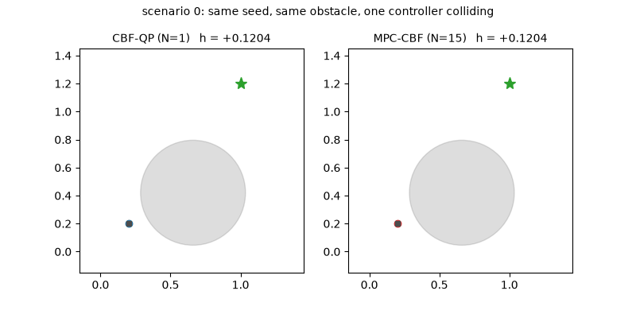
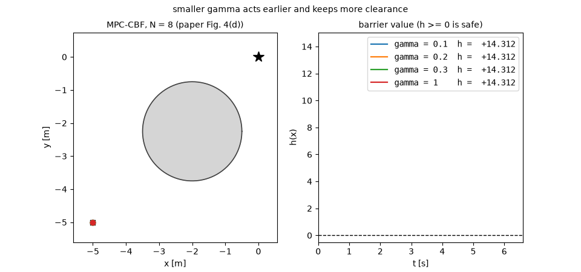
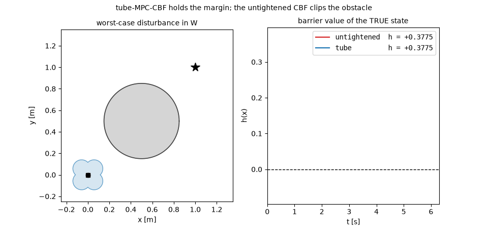

# mpc-cbf

**Discrete-time MPC with control barrier function constraints** — the Zeng-Zhang-Sreenath
ACC 2021 and CDC 2021 formulations reproduced in C++/acados, plus a tube-MPC-CBF extension for
bounded disturbances.

<!-- Badges go here once the workflow has run green on GitHub Actions. -->



*A one-step CBF-QP filter (left) collides with a fast-moving obstacle; MPC-CBF with the same
barrier and the same seed (right) does not. Both traces carry the current `h(x)`.*



*The class-K gain `γ` is the fraction of barrier value the controller may give up per step: small
`γ` acts early and keeps clearance, `γ = 1` grazes the boundary. Reproduces ACC 2021 Fig. 4(d).*



*Worst-case disturbance in `W`. The untightened CBF cuts into the obstacle (`min h = −0.0805`);
tube-MPC-CBF holds the margin (`min h = +0.0369`). The shaded region is the RPI set `Ω` projected
onto position, drawn around the nominal state — the error the certificate bounds.*

## What this is

A single-agent, safety-critical predictive controller in three layers:

| Layer | Constraint | Source |
|---|---|---|
| **MPC-CBF** | `h(x_{k+1}) − h(x_k) ≥ −γ h(x_k)` along the prediction horizon | Zeng, Zhang & Sreenath, ACC 2021 |
| **Relaxed decay** | the decay rate `ω_k` becomes a decision variable, enlarging the feasible set while `ω_k γ ≤ 1` preserves safety | Zeng, Li & Sreenath, CDC 2021 |
| **Tube MPC-CBF** | every constraint tightened by an offline RPI set, so the guarantee holds for the *true* state under bounded disturbance | extension beyond the two papers |

C++/acados for the controller and the ROS 2 node; Python for code generation, the reproduction
notebooks, and an independent solver path that the C++ is checked against.

## Layout

| Path | Contents |
|---|---|
| `mpc_cbf_unified/` | ROS 2 (Lyrical Luth) package: solvers, node, launch files, configs, tests |
| `codegen/` | CasADi model definitions and acados code generation |
| `reproduction/` | Notebooks reproducing the two papers, plus [`REPRODUCTION_REPORT.md`](reproduction/REPRODUCTION_REPORT.md) |
| `analysis/` | CBF-QP vs MPC-CBF, feasibility recovery, disturbance robustness |
| `docs/` | [Math summary](docs/README_math.md), LaTeX derivations, [annotated prior art](docs/PRIOR_ART.md) |
| `media/` | Demo animations, regenerated from the notebooks |

## Quick start

Tested on **Ubuntu 26.04 + ROS 2 Lyrical Luth**, in the `ros:lyrical-ros-base` container.
Everything below is what CI runs.

**1. Build acados** (pinned to `v0.6.0`; HPIPM is the only QP backend used):

```bash
git clone --recursive --branch v0.6.0 --depth 1 https://github.com/acados/acados.git ~/acados
cmake -S ~/acados -B ~/acados/build -DACADOS_INSTALL_DIR=$HOME/acados -DACADOS_WITH_QPOASES=OFF -DACADOS_WITH_OSQP=OFF -DACADOS_EXAMPLES=OFF
```

```bash
cmake --build ~/acados/build --target install -j"$(nproc)"
```

**2. Python environment** (Ubuntu 26.04 marks the system interpreter externally managed, so use a
venv with `--system-site-packages`; do not use `--break-system-packages`):

```bash
python3 -m venv --system-site-packages ~/.venvs/mpccbf && . ~/.venvs/mpccbf/bin/activate && pip install -r codegen/requirements.txt && pip install -e ~/acados/interfaces/acados_template
```

**3. Generate the solvers**, then build. Codegen always runs before `colcon build` — building
against a stale `c_generated_code/` compiles happily and enforces the previous formulation:

```bash
export ACADOS_SOURCE_DIR=$HOME/acados TERA_PATH=$HOME/acados/bin/t_renderer LD_LIBRARY_PATH=$HOME/acados/lib:$LD_LIBRARY_PATH
```

```bash
python codegen/generate_mpc_cbf_solver.py --all && python codegen/generate_tube_solver.py --all
```

```bash
source /opt/ros/lyrical/setup.bash && colcon build --symlink-install --cmake-args -DCMAKE_BUILD_TYPE=Release -DBUILD_TESTING=ON
```

**4. Run the tests:**

```bash
colcon test --event-handlers console_direct+ && colcon test-result --verbose
```

**5. Run the 2-D obstacle demo** (headless; no RViz or Gazebo required):

```bash
source install/setup.bash && ros2 launch mpc_cbf_unified 2d_obstacle.launch.py rviz:=false
```

Without `ACADOS_SOURCE_DIR` set, the package still builds but every solver reports
`kNotInitialized`. That is deliberate: a stub that returned a plausible control would be the most
dangerous thing in this repository.

## Results

Measured on the hardware named in each row; every number is reproducible from the test suite or
from `analysis/`. Full detail, including deviations, in
[`reproduction/REPRODUCTION_REPORT.md`](reproduction/REPRODUCTION_REPORT.md).

| Quantity | Value | Source |
|---|---|---|
| MPC-CBF mean solve time, `N = 8`, 1 obstacle | 1.32 ms | ACC notebook §4 |
| MPC-CBF p95 solve time (RTI) | 0.555 ms | gtest `SolveMeetsRealTimeBudget` |
| Feasible fraction, `γ = 0.3`, `N = 8` | 0.989 | CDC notebook §2 |
| Tube conservatism (path length, zero disturbance) | +12.27 % | robustness sweep §3 |

Hardware for the timings: Intel Core i7-7600U @ 2.80 GHz, Release build, acados v0.6.0 + HPIPM.
CI timings are not quoted — shared runners vary by several multiples.

## Reproductions

Both notebooks run headless in CI and assert their own numbers, so a numerical regression fails
the build.

| Paper | Reproduced | Notebook |
|---|---|---|
| Zeng, Zhang & Sreenath, *Safety-Critical MPC with Discrete-Time CBF*, ACC 2021 | Fig. 1, 4(d), 4(e), 6 — the non-schematic figures | [`reproduce_acc2021.ipynb`](reproduction/zeng_acc2021/reproduce_acc2021.ipynb) |
| Zeng, Li & Sreenath, *Enhancing Feasibility and Safety of NMPC with Discrete-Time CBFs*, CDC 2021 | Fig. 2, 3, 4, 5 | [`reproduce_cdc2021.ipynb`](reproduction/zeng_cdc2021/reproduce_cdc2021.ipynb) |

The report's **Deviations** sections are the important part: the ACC car-racing scenario is
reproduced qualitatively (a kinematic bicycle replaces the paper's data-driven vehicle model), and
the solver differs from the paper's IPOPT, so safety and feasibility claims transfer while timings
do not.

## Limitations

Specific, and load-bearing. A fuller treatment is in
[`docs/README_math.md`](docs/README_math.md) §6.

- **No recursive-feasibility certificate.** Discrete-time CBF constraints inside an MPC do not
  confer it, and neither standard sufficient condition (a terminal control-invariant set, or a
  horizon long enough to reach one) is implemented. Feasibility now does not imply feasibility
  next step. `analysis/feasibility_recovery_study.ipynb` measures the gap instead of asserting it
  away.
- **Safety is conditional on per-step feasibility.** Given a safe start and a feasible solve at
  every step, `h(x_t) ≥ 0` for all `t` — and that hypothesis is exactly what is not guaranteed.
- **The RPI certificate is exact only for the linear model.** For the double integrator the
  discretisation is the exact ZOH map. For the bicycle and planar quadrotor, `Ω` is computed at a
  linearisation point and is a *local* certificate.
- **Obstacle motion is predicted as constant-velocity**, and that prediction error is not inside
  the tube's disturbance set `W` unless you put it there.
- **State-estimation error is not modelled.** The tube covers process disturbance only.
- **Obstacles beyond the nearest 8 are dropped** (distance-pruned to the generated solver's
  capacity), which is wrong in general for a fast obstacle approaching from outside that set.
- **Nothing here addresses multi-agent coupling.** That is the work this repository feeds, not
  something it implements.

## Citing

See [`CITATION.cff`](CITATION.cff). This solver is the per-agent inner problem of the author's
transition-viable swarm work; the reproductions establish the baselines that work cites.

## License

BSD-3-Clause — see [LICENSE](LICENSE).
